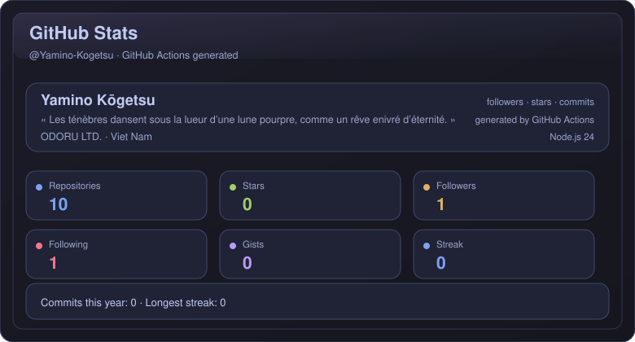
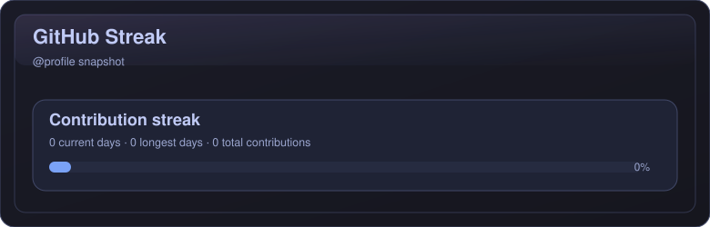

# GitHub Readme Stats Actions Root

This repo generates SVG cards in the repository root using **GitHub Actions** and **Node.js 24**.

## What gets generated

- `stats.svg`
- `top-langs.svg`
- `repo-card.svg`
- `streak.svg`

## Demo




## Setup

1. Push this repo to GitHub.
2. Edit `config.json`.
3. Add a repository secret named `GH_PAT`.
4. Run the workflow in the **Actions** tab.

## Important

There are **no SVG files committed initially**. The first Actions run creates them in the repository root and commits them back.

## Embed in README

```md


```

## Token

For public profile data, a classic PAT with `read:user` is usually enough.

## License

MIT. See [`LICENSE`](./LICENSE).
